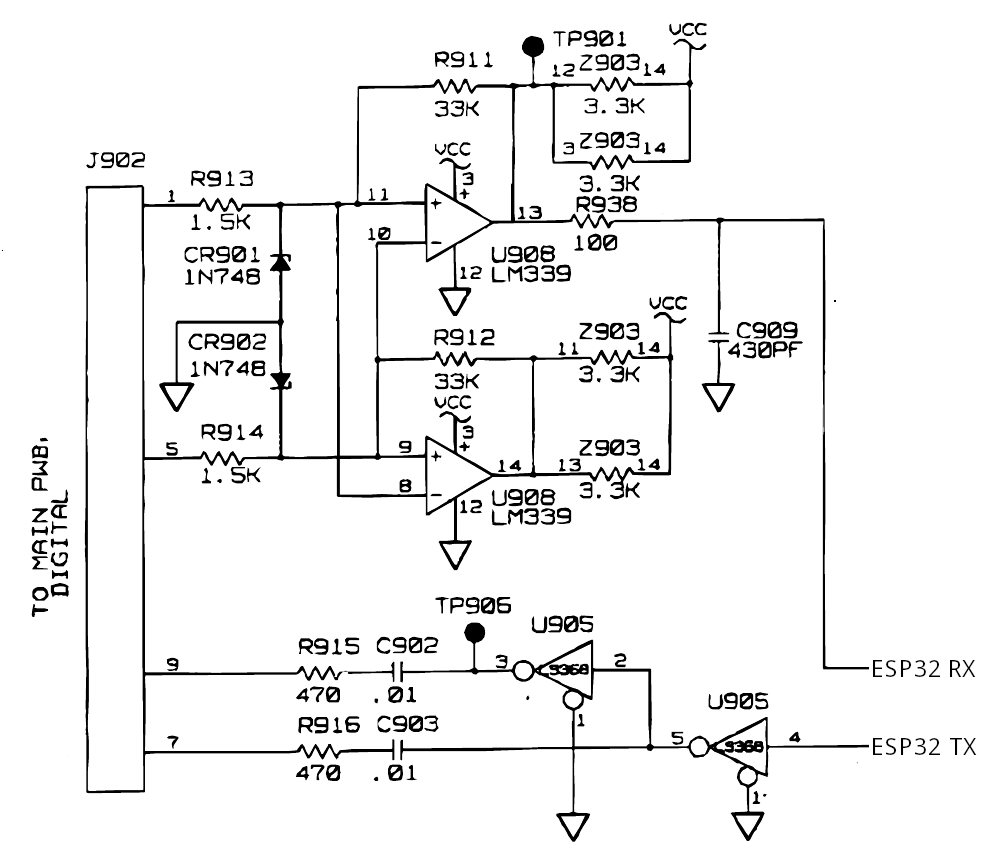

# 8840A IO Card

A replacement for the GPIB interface (option 005) for the Fluke 8840A series of benchtop multimeters.

Tested With:

- [x] Fluke 8840AF
- [ ] Fluke 8840A
- [ ] Fluke 8842A

## Compiling

The Arduino code requies the following libraries to be installed:

- [Vrekrer scpi parser](https://github.com/Vrekrer/Vrekrer_scpi_parser)
- [AsyncTCP](https://github.com/me-no-dev/AsyncTCP)

Open the the `8840a_io_card` folder in Arduino IDE and edit the WiFi credentials in `8840a_io_card.ino`.

## Interfacing

You will need to connect the ESP32 with a circuit like this:



## Protocol

8840a_io_card speaks (mostly standard) SCPI on the computer side of the interface, either over 500000 baud USB serial or TCP port 5025. The identify command returns fake manufacturer/model in order to trick libsigrok to communicating without modification.

Communication with `sigrok-cli` and [SmuView](https://github.com/knarfS/smuview) works fine.

### Examples

```sh
sigrok-cli --driver scpi-dmm:conn=tcp-raw/x.x.x.x/5025 --samples 10
sigrok-cli --driver scpi-dmm:conn=/dev/ttyUSB0 --samples 10
```

## TODO

- SCPI IP config
- Ethernet (W5500 or maybe ESP32's built in MAC/LAN8720?)

## Credits

Massive thanks to [Burner_357](https://www.eevblog.com/forum/projects/fluke8840a-ieee-488-redesign-(ethernet-replacement-for-gpib-option-05)/) on the EEVBlog forum
